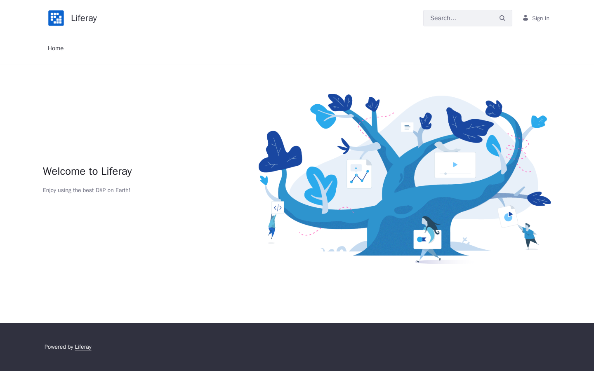
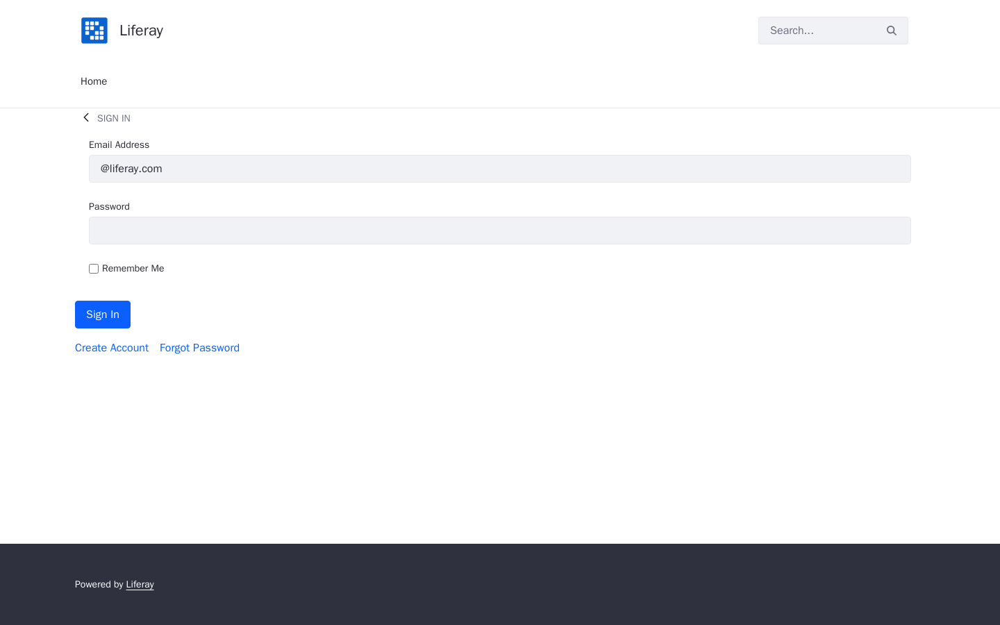
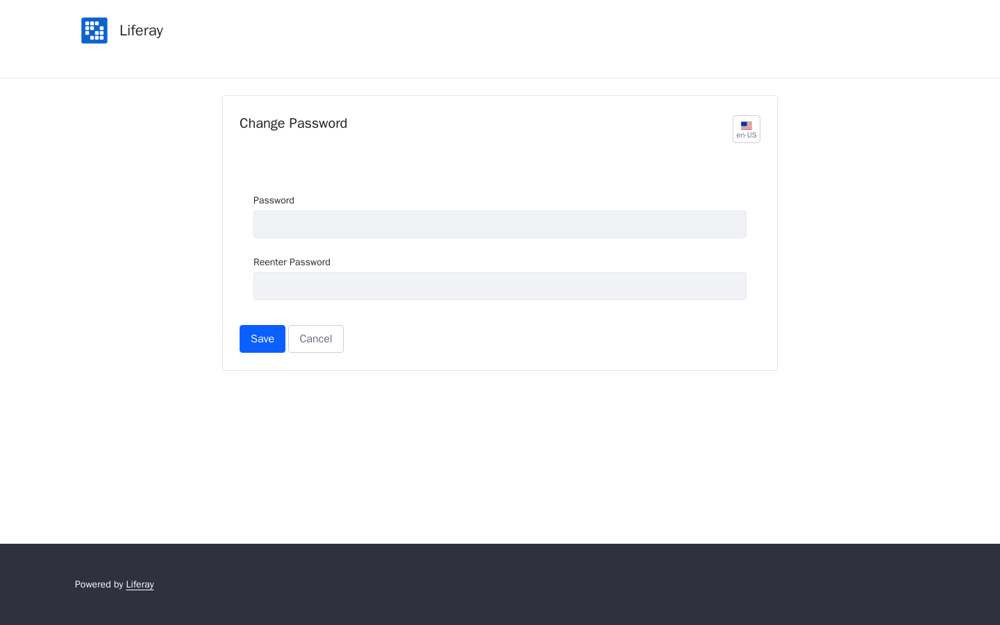
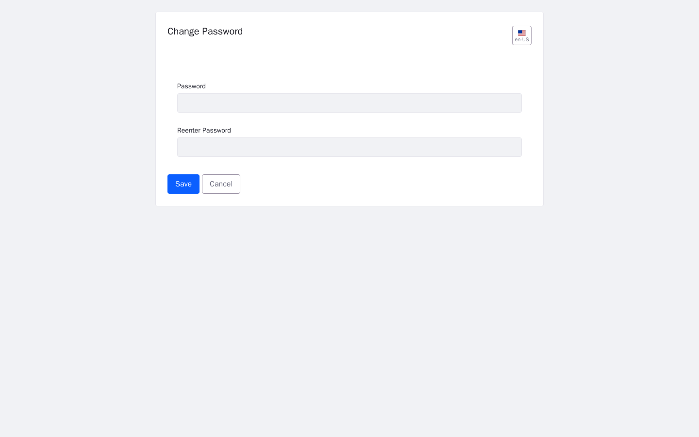

# Tracer-MED for Liferay

**Winnex AI | Klenio Padilha**
Winnex Brasil Solucoes Empresariais LTDA - CNPJ 58.364.637/0001-47
Contact: **pay@winnex.ai** | Website: **https://winnex.ai**
License: **Business Source License 1.1 (BSL 1.1)**


---

## Welcome

Tracer-MED is a **clinical triage and research tool** for Liferay that gives
you something traditional search cannot: a **mathematical proof** that no
relevant clinical record was lost.

It is powered by **Winnex Madhava** (the deterministic vector-search engine)
and integrates natively with your Liferay portal as a ready-to-use widget.

**This README is for you if you are going to use or deploy Tracer-MED.**
For deeper technical details, see the [Usage examples](#usage-examples) and
the [Documentation](#documentation) sections at the end.

---

## What it does

- Lets your clinicians and staff search clinical records by **meaning**
  (semantic search), not just keywords.
- Returns each search together with a **soundness guarantee**: either
  *"0 bound violations - no relevant record was lost"*, or a warning to
  investigate.
- Keeps every company/site in your portal **isolated** (multi-tenant): a user
  of one company can never see another company's clinical corpus.
- Produces **audit-ready** results that support LGPD (Brazil), GDPR Art. 9
  (EU) and HIPAA (US) self-assessment reporting.

> **In one sentence:** *"Replace probability with proof, in the service of
> health."*

---

## Screen demos

### Liferay home (guest)



The portal landing page, before login.

### Login



Standard Liferay sign-in. Default demo admin: `test@liferay.com` / `test`.

### Authenticated home



The portal as seen by a logged-in user. The **Tracer-MED** widget is available
under **Add -> Widgets -> Winnex**.

### Tracer-MED portlet


The Tracer-MED portlet, active and registered. Every authenticated user of the
portal can run a clinical triage with the mathematical proof.

### Control panel



The Liferay control panel, where the deployed Winnex bundles are managed.

---

## Quick start

### 1. Start the stack

```bash
docker compose -f liferay/docker-compose.yml up -d
```

This starts:
- **Liferay** 7.4 (portal on `http://localhost:8080`)
- **PostgreSQL** 16 (Liferay database)
- **madhava-service** (the Winnex Madhava engine, on `http://localhost:8600`)

### 2. Wait for the portal

```bash
curl -I http://localhost:8080        # -> 200
```

The first boot can take a few minutes while Liferay initializes.

### 3. Check the engine

```bash
curl -s http://localhost:8600/v1/health
```

Expected:

```json
{ "status": "ok", "engine": "winnex-madhava 1.8.8", "tenants": [] }
```

### 4. Log in

- URL: `http://localhost:8080`
- Default demo admin: `test@liferay.com` / `test`

---

## Using Tracer-MED

### Add the widget to a page

1. Log in to your Liferay portal.
2. Open a page and click **Add**.
3. Go to **Widgets** -> **Winnex**.
4. Drag **Tracer-MED** onto the page.

### Run a clinical search

1. Type a clinical query, e.g. `hypertension management`.
2. Optionally filter by:
   - **ICD-10** (e.g. `I10`)
   - **Department** (e.g. `Cardiology`)
3. Set **Top-K** (how many results to show).
4. Click **Search with proof**.

### Read the result

The widget shows the matching records **plus the guarantee**:

- **Sound proof:** *0 bound violations (no relevant record lost). Bound pairs
  evaluated: N.*
- Or, if anything is wrong: **BOUND VIOLATION - investigate.**

This guarantee is what makes Tracer-MED different: you are not asked to trust
the algorithm, you are given a **per-document proof**.

---

## What the guarantee means

Every result carries a mathematical certificate based on the
**Cauchy-Schwarz inequality**. For each record the engine computes an upper
bound on how similar it can be to your query. If the bound proves the record
cannot be in the top-K, the record is excluded **with proof** -- never by
guesswork.

| Field | Example | Meaning |
|---|---|---|
| `bound_violations` | `0` | No relevant record was lost. This is the guarantee. |
| `sound` | `true` | Convenience flag: `bound_violations == 0`. |
| `bound_pairs` | `8` | Number of (record, bound) evaluations in this search. |
| `latency_ms` | `3.2` | Search latency in milliseconds. |
| `engine` | `winnex-madhava 1.8.8` | The engine that produced the proof. |

---

## Multi-tenant

Each company (site) in your Liferay portal is mapped to an **isolated**
Madhava index:

```
Liferay companyId 1001  ->  tenant_id = "liferay-1001"
Liferay companyId 2002  ->  tenant_id = "liferay-2002"
```

A user of company A can never query the clinical corpus of company B. This
isolation is enforced by the engine, not by the UI.

---

## Compliance

Tracer-MED supports health-data compliance reporting:

- **LGPD** (Brazil) - health data is sensitive data (Art. 5 II, Art. 11)
- **GDPR** (EU) - special categories: health (Art. 9)
- **HIPAA** (US) - Privacy Rule / audit

All reports are **self-assessment templates**, not certifications. The
mathematical proof and the audit trail are the technical basis that makes
these reports meaningful.

---

## Usage examples

Real, ready-to-use implementations (in English) live in the `examples/`
directory. If you are a developer integrating Tracer-MED, start here:

| # | Example | What it does |
|---|---|---|
| [01](examples/01-portlet-semantic-search/README.md) | Portlet semantic search | The production portlet: search clinical records with proof and filters. |
| [02](examples/02-rest-resource/README.md) | REST API | Expose `/o/rest/tracer-med/*` for any front-end or integration. |
| [03](examples/03-scheduler/README.md) | Auto-index scheduler | Keep a tenant's index fresh automatically (ingestion). |
| [04](examples/04-service-builder/README.md) | Audit persistence | Save every triage (query + proof) in the Liferay database. |
| [05](examples/05-standalone-client/README.md) | Standalone client | A pure-Java client to the engine (the contract of the bridge). |
| [07](examples/07-qr-certificate/README.md) | QR-code certificate | Emit a scannable Mathematical Audit Certificate. |
| [scripts](examples/scripts/README.md) | Live demo | cURL end-to-end: health -> index -> search with proof. |

---

## System requirements

| Component | Requirement |
|---|---|
| Liferay | DXP or Portal CE **7.4.3.132+** |
| JDK | 11 or 17 |
| Python (microservice) | **3.12** (the `winnex-madhava` wheel is cp312) |
| RAM | 4 GB minimum for the Liferay container; 1 GB for the Madhava container |
| Docker | Docker + Docker Compose |
| Network | Ports 8080 (Liferay) and 8600 (Madhava) reachable between containers |
| API key | A strong `MADHAVA_API_KEY` value shared between Liferay and the microservice (production) |

---

## Common issues (troubleshooting)

### "The portlet shows Timeout"

1. Check the `madhava-service` container is healthy:
   ```bash
   docker compose -f liferay/docker-compose.yml ps
   ```
2. Check the engine responds:
   ```bash
   curl -s http://localhost:8600/v1/health
   ```
3. In Liferay, open **Control Panel -> System Settings -> Winnex Madhava
   Service** and confirm `baseUrl` points to `http://madhava-service:8600`
   (or the correct HTTPS URL in production).

### "Search returns 'tenant not indexed'"

The corpus for that company has not been ingested yet. Index it first:

```bash
curl -X POST http://localhost:8600/v1/index \
  -H "Content-Type: application/json" \
  -H "X-Winnex-Api-Key: <your-key>" \
  -d '{"tenant_id": "liferay-1001", "corpus": [...]}'
```

### "I get 401 Unauthorized from the microservice"

The API key does not match. In production set `MADHAVA_API_KEY` on the
microservice (via `.env`, see `.env.example`) and configure the **same** value
in Liferay System Settings. Verify the `X-Winnex-Api-Key` header is being
sent by the bridge.

### "bound_violations > 0"

The guarantee was violated - investigate immediately. Common causes:

- The input data does not respect the **float32 normalization contract**
  (see the [Model Integration Guide](docs/MODEL_INTEGRATION_GUIDE.md)).
- The corpus was indexed with vectors from a different embedding model than
  the query.
- A floating-point edge case at the boundary (extreme dimensions).

### "The QR code shows INVALID on verification"

The hash was not registered at issuance, or the URL was tampered with.
Re-issue the certificate from the triage audit record (see
[Example 07](examples/07-qr-certificate/README.md)).

### "The audit says 'Auditoria matematica temporariamente indisponivel'"

The microservice was unreachable (or returned an error) during the triage.
The request was marked `DEGRADED` / `UNREACHABLE` so the clinical flow could
continue. Check:

- The `madhava-service` container is healthy.
- The `baseUrl` in Liferay System Settings is correct.
- The Liferay log for `Madhava service unreachable: ...` to find the root
  cause.

### "Liferay is using Hypersonic instead of PostgreSQL"

The `portal-ext.properties` JDBC config was not applied. Ensure
`liferay/files/portal-ext.properties` has the `jdbc.default.*` entries and
restart the container.

---

## Documentation

- **[Model Integration Guide](docs/MODEL_INTEGRATION_GUIDE.md)** - how to
  prepare your clinical data (text, vitals, ICD-10) into the float32 vectors
  Madhava understands, and how to interpret the results.
- **[Changelog](CHANGELOG.md)** - version history and dependencies.

> Internal engineering notes (bridge study, installation plan) are kept in
> `internal/` and are not part of the distribution package.

---

## License

**Business Source License 1.1 (BSL 1.1)** - source-available, not OSI
open-source.

| Field | Value |
|---|---|
| License | Business Source License 1.1 (BSL 1.1) |
| Contact | `pay@winnex.ai` |
| Author | Winnex AI | Klenio Padilha |
| Owner / Vendor | Winnex Brasil Solucoes Empresariais LTDA (CNPJ 58.364.637/0001-47) |
| Change Date | 2036-01-01 |
| Change License | GPL v2.0 or later |
| Free for | Brazilian government agencies (Additional Use Grant) |
| Commercial use | Requires a license agreement with Winnex AI |

**Medical disclaimer:** Tracer-MED is NOT a medical device. It is not
FDA/ANVISA/CE certified and is not a substitute for clinical judgment.
Compliance reports are self-assessment templates, not certifications.

---

*Winnex AI -- "Replace probability with proof, in the service of health."*
*Business Source License 1.1 | pay@winnex.ai | Winnex Brasil Solucoes
Empresariais LTDA (CNPJ 58.364.637/0001-47)*
