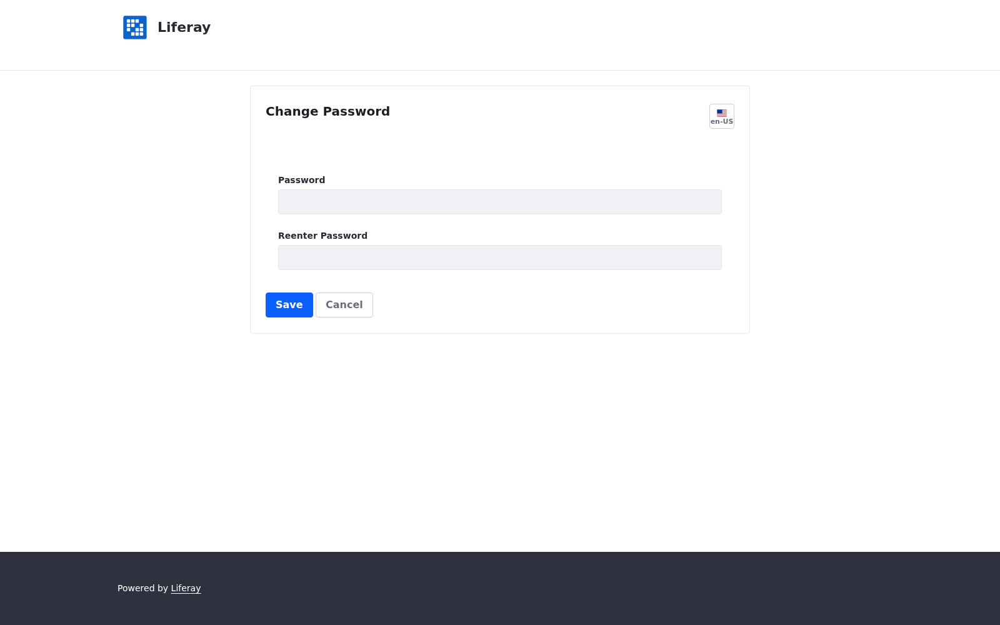
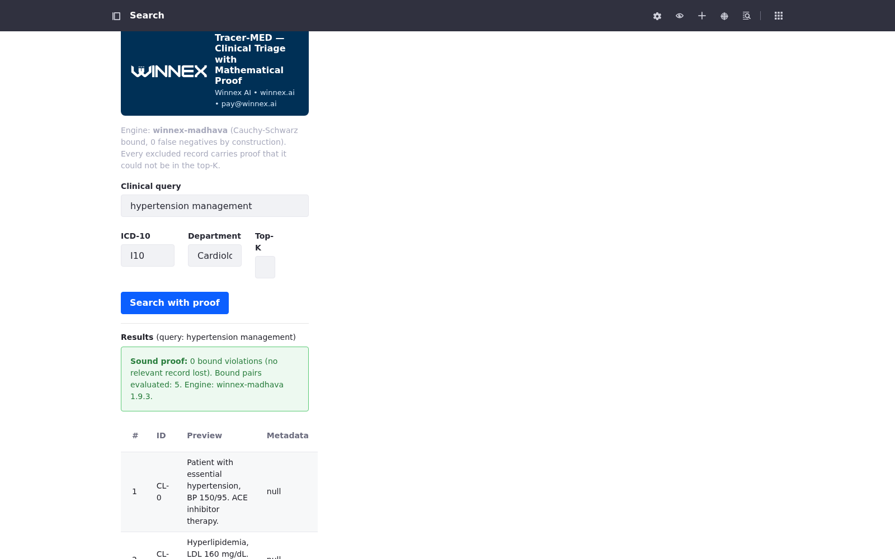
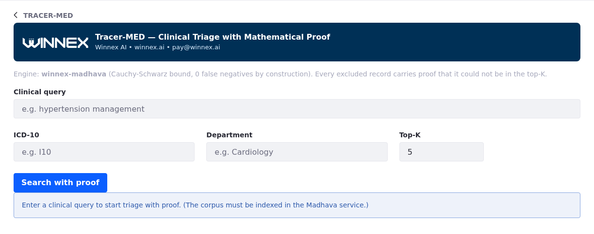

# Tracer-MED for Liferay

**Winnex AI | Klenio Padilha**
Winnex Brasil Solucoes Empresariais LTDA - CNPJ 58.364.637/0001-47
Contact: **pay@winnex.ai** | Website: **https://winnex.ai**
License: **Business Source License 1.1 (BSL 1.1)**


---

## Welcome

Tracer-MED is a **clinical triage and research tool** for Liferay that gives
you something traditional search cannot: a **mathematical proof** that no
relevant clinical record was lost.

It is powered by **Winnex Madhava** (the deterministic vector-search engine)
and integrates natively with your Liferay portal as a ready-to-use widget.

**This README is for you if you are going to use or deploy Tracer-MED.**
For deeper technical details, see the [Usage examples](#usage-examples) and
the [Documentation](#documentation) sections at the end.

---

## What it does

- Lets your clinicians and staff search clinical records by **meaning**
  (semantic search), not just keywords.
- Returns each search together with a **soundness guarantee**: either
  *"0 bound violations - no relevant record was lost"*, or a warning to
  investigate.
- Keeps every company/site in your portal **isolated** (multi-tenant): a user
  of one company can never see another company's clinical corpus.
- Produces **audit-ready** results that support LGPD (Brazil), GDPR Art. 9
  (EU) and HIPAA (US) self-assessment reporting.

> **In one sentence:** *"Replace probability with proof, in the service of
> health."*

---

## Important: Tracer-MED is NOT a plug-and-play RAG solution

> **Please read this before you buy or deploy.**

**Tracer-MED is Madhava made easy in Liferay.** It is the
guaranteed-retrieval layer + the Liferay UI already built: the portlet, the
engine bridge, the soundness proof and the audit trail all work out of the
box. What is **not** included is the data side (embeddings, encoding, tuning,
optional LLM answers). It is therefore **not** a complete, out-of-the-box RAG
(Retrieval-Augmented Generation) product. In particular:

- **You must generate the embeddings yourself.** The Madhava engine does **not**
  embed text. It has no "give me text, get me a vector" endpoint. Its input is
  already-embedded **float32 vectors** (see the
  [Model Integration Guide](docs/MODEL_INTEGRATION_GUIDE.md) for the exact
  contract).
- **RAG answers (LLM-generated responses) are not included.** Tracer-MED
  returns the ranked clinical records **plus the soundness proof**; it does not
  generate an answer paragraph from them.

### Why there is no plug-and-play: your data decides

"Plug and play" would mean every hospital has identical data -- same language,
same specialties, same structured fields, same scale, same ingestion source.
No two do. Each of the scenarios below changes at least one component of the
pipeline, and it is exactly **this variability that Winnex solves for you**
(see "Your options", below).

| Scenario | What it forces you to decide |
|---|---|
| **Free-text clinical notes** | Which embedding model, and for which **language and domain** (PT vs EN; radiology vs cardiology vs discharge summaries). Domain mismatch silently degrades retrieval. Model choice, dimension and token limits are decisions, not defaults. |
| **Structured-only data** (vitals, labs, scores) | A numeric **feature vector** design: how to clip and scale each field, and what "similarity" means in *your* feature space. Different scaling = different results. |
| **Categorical data** (ICD-10, departments, procedures) | A frozen **codebook** (which codes exist in *your* org) and a one-hot/embedding encoding. New codes added later change the space and require re-indexing. |
| **Mixed records** (text + vitals + ICD-10) | How to combine the signals into **one unit-norm vector** (concatenate? weight? separate index?) and re-normalize. There is no universal recipe; the mix differs per client. |
| **Scale** | Hundreds of docs (linear scan with proof, defaults are fine) vs millions (tight PCA-based bounds, cascade tuning, `early_exit`, possibly GPU). The settings that make sense at 500 documents are not the ones at 5M. |
| **Ingestion source** | SQL, FHIR, CSV, PDFs -- each needs its own loader/normalizer seam (the scheduler's `CorpusLoader`). There is no single import path. |
| **Tenant & corpora shape** | How companies map to isolated indices, and whether the codebook is shared or per-tenant. Isolation is guaranteed by the engine, but the mapping is a design choice. |
| **Output expectations** | Retrieval-with-proof only vs retrieval + LLM answers (RAG) vs full question-answering with citations. Each is a different scope of work. |

Any one of these scenarios is enough to make a generic pipeline wrong; in
practice most clients present several at once. That is normal -- and it is the
reason Winnex offers a full menu below.

### What Tracer-MED actually does

```
Your text / vitals / ICD-10
        |
        |   (embedding happens HERE -- outside Madhava,
        |    with BGE, BlueBERT, OpenAI, your own model, ...)
        v
   float32 vectors  ----POST /v1/index---->  winnex-madhava (retrieval + proof)
                                                     |
                       POST /v1/search <------------+  ranked records
                            |                            + bound_violations: 0
                            v
                     Tracer-MED portlet (Liferay UI)
```

Madhava v1.8.8 is a **vector search engine with a mathematical guarantee**.
Its public tuning surface is vector-side: `metric="cosine"`, `stage1_dim` /
`stage2_dim` (projection cascade, defaults 64 / 128), `k`, `k1_fraction`,
`modulation`, `postfilter`, `normalize_input`, and `early_exit`. At
million-scale corpora the engine can also use tighter PCA-based bounds
(`basis="pca_corpus"`, see the
[Model Integration Guide](docs/MODEL_INTEGRATION_GUIDE.md)). Every one of these
parameters operates on **vectors** -- none of them turns text into vectors for
you.

### How to get the embeddings

| Your data | Who generates the vectors |
|---|---|
| Text (clinical notes, reports) | An embedding model -- BGE, BlueBERT, OpenAI, Qwen, or your own |
| Structured (vitals, labs) | A numeric encoder you (or Winnex) implement |
| Categorical (ICD-10, department) | One-hot / embedding encoding |
| Mixed | Concatenate the encodings into one unit-norm vector |

---

### Your options -- choose the level of involvement

Winnex offers **three ways** to take Tracer-MED into production. Pick the one
that fits your team and budget; all of them end with the same Madhava
guarantee.

| Option | What you get | Best for |
|---|---|---|
| **A. Winnex implementation service** | Winnex builds your complete pipeline: embedding-model selection, the inference/encoding step, the RAG orchestration (retrieval + LLM answer) if you want it, Madhava tuning, and the go-live. You use the UI and read the proofs. | Teams that want it done, correct, and proven, without building ML in-house. |
| **B. Winnex full inference stack** | Our ready-made embedding / inference infrastructure (a separate product) wired to Tracer-MED: vectors generated for you at scale, retrieval with proof, and optional LLM answers -- no model glue on your side. | Teams that prefer a managed stack over running their own models. |
| **C. Your existing stack** | Bring your own embeddings and/or your own LLM. Tracer-MED's Madhava bridge consumes the float32 vectors your stack produces -- the proof and the audit work the same on top of your pipeline. | Teams with an existing ML/LLM stack that just want the guaranteed retrieval layer + UI. |

### The wider Winnex AI product family

Tracer-MED is one deployment of Madhava, and the integration does not stop
here. Winnex also ships:

- **OpenAI-compatible API plug** -- expose Madhava behind an OpenAI-style
  endpoint, so tools and agents that already speak the OpenAI API can call it
  with zero new code.
- **Inference stack** -- the managed embedding/LLM infrastructure used in
  Option B, also available standalone for non-Liferay projects.

You can start with Tracer-MED on top of whatever stack you have today
(Option C), let Winnex build it (Option A), or run the full Winnex stack
(Option B). If your project is not Liferay, the OpenAI-compatible plug and the
inference stack let you use Madhava's guarantee anywhere.

> **To budget an inference or RAG implementation, email
> [info@winnex.ai](mailto:info@winnex.ai)**. Tell us your data format, your
> volume, your current stack, and whether you want retrieval-with-proof only or
> retrieval + LLM answers, and we will quote the right option for you.

---

## Screen demo (what the portlet shows)

### Liferay login



Standard Liferay sign-in. Default demo admin: `test@liferay.com` / `test`.

### Tracer-MED portlet with results + proof



The portlet shows: the clinical query form (query + ICD-10 + department
filters), the **sound proof** banner (0 bound violations, no relevant record
lost), the bound pairs evaluated, the engine, and the ranked results table
(external ID + preview).

### Tracer-MED portlet in edit mode



The portlet can be added to any page from the Liferay widget panel under
**Winnex → Tracer-MED**.

---

## Quick start

### 1. Start the stack

```bash
docker compose -f liferay/docker-compose.yml up -d
```

This starts:
- **Liferay** 7.4 (portal on `http://localhost:8080`)
- **PostgreSQL** 16 (Liferay database)
- **madhava-service** (the Winnex Madhava engine, on `http://localhost:8600`)

### 2. Wait for the portal

```bash
curl -I http://localhost:8080        # -> 200
```

The first boot can take a few minutes while Liferay initializes.

### 3. Check the engine

```bash
curl -s http://localhost:8600/v1/health
```

Expected:

```json
{ "status": "ok", "engine": "winnex-madhava 1.8.8", "tenants": [] }
```

### 4. Log in

- URL: `http://localhost:8080`
- Default demo admin: `test@liferay.com` / `test`

---

## Using Tracer-MED

### Add the widget to a page

1. Log in to your Liferay portal.
2. Open a page and click **Add**.
3. Go to **Widgets** -> **Winnex**.
4. Drag **Tracer-MED** onto the page.

### Run a clinical search

1. Type a clinical query, e.g. `hypertension management`.
2. Optionally filter by:
   - **ICD-10** (e.g. `I10`)
   - **Department** (e.g. `Cardiology`)
3. Set **Top-K** (how many results to show).
4. Click **Search with proof**.

### Read the result

The widget shows the matching records **plus the guarantee**:

- **Sound proof:** *0 bound violations (no relevant record lost). Bound pairs
  evaluated: N.*
- Or, if anything is wrong: **BOUND VIOLATION - investigate.**

This guarantee is what makes Tracer-MED different: you are not asked to trust
the algorithm, you are given a **per-document proof**.

---

## What the guarantee means

Every result carries a mathematical certificate based on the
**Cauchy-Schwarz inequality**. For each record the engine computes an upper
bound on how similar it can be to your query. If the bound proves the record
cannot be in the top-K, the record is excluded **with proof** -- never by
guesswork.

| Field | Example | Meaning |
|---|---|---|
| `bound_violations` | `0` | No relevant record was lost. This is the guarantee. |
| `sound` | `true` | Convenience flag: `bound_violations == 0`. |
| `bound_pairs` | `8` | Number of (record, bound) evaluations in this search. |
| `latency_ms` | `3.2` | Search latency in milliseconds. |
| `engine` | `winnex-madhava 1.8.8` | The engine that produced the proof. |

---

## Multi-tenant

Each company (site) in your Liferay portal is mapped to an **isolated**
Madhava index:

```
Liferay companyId 1001  ->  tenant_id = "liferay-1001"
Liferay companyId 2002  ->  tenant_id = "liferay-2002"
```

A user of company A can never query the clinical corpus of company B. This
isolation is enforced by the engine, not by the UI.

---

## Compliance

Tracer-MED supports health-data compliance reporting:

- **LGPD** (Brazil) - health data is sensitive data (Art. 5 II, Art. 11)
- **GDPR** (EU) - special categories: health (Art. 9)
- **HIPAA** (US) - Privacy Rule / audit

All reports are **self-assessment templates**, not certifications. The
mathematical proof and the audit trail are the technical basis that makes
these reports meaningful.

---

## Usage examples

Reference patterns (in English) live in the `examples/` directory. Each one
shows, with code snippets, how a specific integration is done. If you are a
developer integrating Tracer-MED, start here:

| # | Example | What it shows |
|---|---|---|
| [01](examples/01-portlet-semantic-search/README.md) | Portlet semantic search | The production portlet: search clinical records with proof and filters. |
| [02](examples/02-rest-resource/README.md) | REST API | Expose `/o/rest/tracer-med/*` for any front-end or integration. |
| [03](examples/03-scheduler/README.md) | Auto-index scheduler | Keep a tenant's index fresh automatically (ingestion). |
| [04](examples/04-service-builder/README.md) | Audit persistence | Save every triage (query + proof) in the Liferay database. |
| [05](examples/05-standalone-client/README.md) | Standalone client | A pure-Java HTTP client to the engine (the contract of the bridge). |
| [07](examples/07-qr-certificate/README.md) | QR-code certificate | Emit a scannable Mathematical Audit Certificate. |
| [scripts](examples/scripts/README.md) | Live demo | cURL end-to-end: health -> index -> search with proof. |

---

## System requirements

| Component | Requirement |
|---|---|
| Liferay | DXP or Portal CE **7.4.3.132+** |
| JDK | 11 or 17 |
| Python (microservice) | **3.12** (the `winnex-madhava` wheel is cp312) |
| RAM | 4 GB minimum for the Liferay container; 1 GB for the Madhava container |
| Docker | Docker + Docker Compose |
| Network | Ports 8080 (Liferay) and 8600 (Madhava) reachable between containers |
| API key | A strong `MADHAVA_API_KEY` value shared between Liferay and the microservice (production) |

---

## Common issues (troubleshooting)

### "The portlet shows Timeout"

1. Check the `madhava-service` container is healthy:
   ```bash
   docker compose -f liferay/docker-compose.yml ps
   ```
2. Check the engine responds:
   ```bash
   curl -s http://localhost:8600/v1/health
   ```
3. In Liferay, open **Control Panel -> System Settings -> Winnex Madhava
   Service** and confirm `baseUrl` points to `http://madhava-service:8600`
   (or the correct HTTPS URL in production).

### "Search returns 'tenant not indexed'"

The corpus for that company has not been ingested yet. Index it first:

```bash
curl -X POST http://localhost:8600/v1/index \
  -H "Content-Type: application/json" \
  -H "X-Winnex-Api-Key: <your-key>" \
  -d '{"tenant_id": "liferay-1001", "corpus": [...]}'
```

### "I get 401 Unauthorized from the microservice"

The API key does not match. In production set `MADHAVA_API_KEY` on the
microservice (via `.env`, see `.env.example`) and configure the **same** value
in Liferay System Settings. Verify the `X-Winnex-Api-Key` header is being
sent by the bridge.

### "bound_violations > 0"

The guarantee was violated - investigate immediately. Common causes:

- The input data does not respect the **float32 normalization contract**
  (see the [Model Integration Guide](docs/MODEL_INTEGRATION_GUIDE.md)).
- The corpus was indexed with vectors from a different embedding model than
  the query.
- A floating-point edge case at the boundary (extreme dimensions).

### "The QR code shows INVALID on verification"

The hash was not registered at issuance, or the URL was tampered with.
Re-issue the certificate from the triage audit record (see
[Example 07](examples/07-qr-certificate/README.md)).

### "The audit says 'Auditoria matematica temporariamente indisponivel'"

The microservice was unreachable (or returned an error) during the triage.
The request was marked `DEGRADED` / `UNREACHABLE` so the clinical flow could
continue. Check:

- The `madhava-service` container is healthy.
- The `baseUrl` in Liferay System Settings is correct.
- The Liferay log for `Madhava service unreachable: ...` to find the root
  cause.

### "Liferay is using Hypersonic instead of PostgreSQL"

The `portal-ext.properties` JDBC config was not applied. Ensure
`liferay/files/portal-ext.properties` has the `jdbc.default.*` entries and
restart the container.

---

## Documentation

- **[Model Integration Guide](docs/MODEL_INTEGRATION_GUIDE.md)** - how to
  prepare your clinical data (text, vitals, ICD-10) into the float32 vectors
  Madhava understands, and how to interpret the results.
- **[Changelog](CHANGELOG.md)** - version history and dependencies.

> Internal engineering notes (bridge study, installation plan) are kept in
> `internal/` and are not part of the distribution package.

---

## License

**Business Source License 1.1 (BSL 1.1)** - source-available, not OSI
open-source.

| Field | Value |
|---|---|
| License | Business Source License 1.1 (BSL 1.1) |
| Contact | `pay@winnex.ai` |
| Author | Winnex AI | Klenio Padilha |
| Owner / Vendor | Winnex Brasil Solucoes Empresariais LTDA (CNPJ 58.364.637/0001-47) |
| Change Date | 2036-01-01 |
| Change License | GPL v2.0 or later |
| Free for | Brazilian government agencies (Additional Use Grant) |
| Commercial use | Requires a license agreement with Winnex AI |

**Medical disclaimer:** Tracer-MED is NOT a medical device. It is not
FDA/ANVISA/CE certified and is not a substitute for clinical judgment.
Compliance reports are self-assessment templates, not certifications.

---

*Winnex AI -- "Replace probability with proof, in the service of health."*
*Business Source License 1.1 | pay@winnex.ai | Winnex Brasil Solucoes
Empresariais LTDA (CNPJ 58.364.637/0001-47)*
